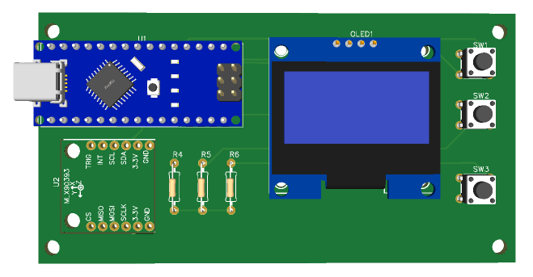
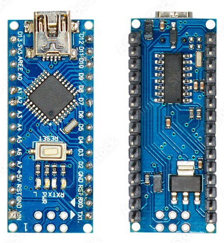
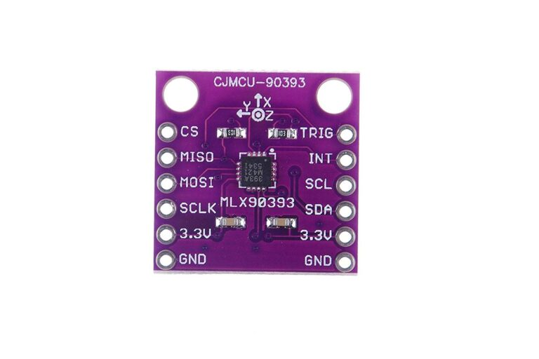
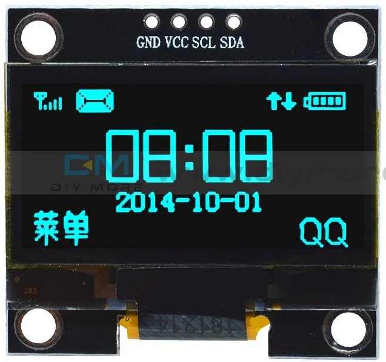
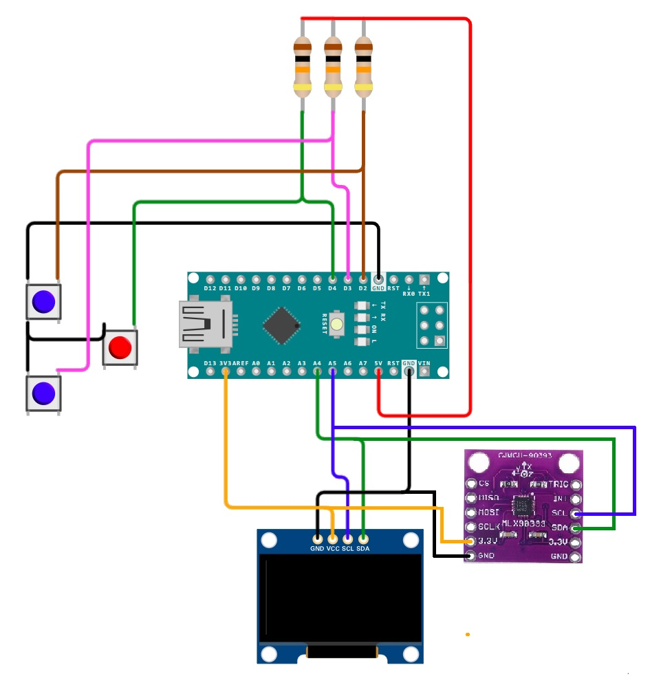

# MagSenseUI
# Diagnostic Interface for Magnetic Sensor Calibration in Electromechanical Systems

## 🎯 Project Purpose

The **MagSenseUI** project was developed to address a specific diagnostic challenge in electromechanical systems—particularly in machines like **Bill Validators** that rely on magnetic sensors for operation.

The program includes an intuitive **menu** system that allows users to configure the **sensor gain** and choose the data output mode. Users can select whether the magnetic field readings are displayed directly on the OLED screen or streamed via the Arduino's **serial port** to a connected PC. This flexibility makes it easy to adapt the system for both standalone field diagnostics and detailed data logging or analysis on a computer.

## 🧰 **Hardware Components**

| Component         | Description                                      |
|------------------|--------------------------------------------------|
| [Arduino Nano](doc/nano.pdf)      | Microcontroller (ATmega328P)                    |
| [OLED Display 1.3"](doc/SH1106.pdf) | SH1106-based I2C monochrome display             |
| [MLX90393 Sensor](doc/MLX90393.PDF)   | 3-axis magnetometer with adjustable gain        |
| Push Buttons (x3) | For menu navigation and selection               |



## 🧭 **Menu System**

```plaintext
[ Configuration Menu ]
-----------------------
1. Gain: 1X
2. Gain: 1.33X
3. Gain: 1.67X
4. Gain: 2X
5. Gain: 2.5X
6. Gain: 3X
7. Gain: 4X
8. Gain: 5X
9. Enable Serial Output
```


### 🧩 Problem Context

These machines often operate in environments where **strong neodymium magnets** are permanently present. While these magnets are essential to the machine’s function, they also create a **constant magnetic field** that can interfere with nearby components.

One such component is the **metallic bearing**. Under normal conditions, the bearing is non-magnetic. However, if it becomes **magnetized due to external contamination** (e.g., exposure to magnetic particles or prolonged proximity to strong fields), it can **distort the local magnetic environment**. This distortion may lead to **false readings or operational errors** in the machine’s magnetic sensors.

### 🧪 Why MagSenseUI?

While a traditional compass can detect strong magnetization, it **fails to detect subtle or low-level magnetization**. This is where **MagSenseUI** excels.

- It uses the **MLX90393** high-resolution 3-axis magnetometer to **detect even slight magnetic anomalies**.
- The system allows the user to **select different gain levels**, enhancing sensitivity to weak fields.
- Through a simple OLED interface and serial output mode, it provides **real-time feedback** on the magnetic field strength in microteslas (µT).
- This enables technicians to **identify which bearing is magnetized**, even if the magnetization is minimal and invisible to conventional tools.

---

## 🔧 Technical Specifications

### 🧠 Arduino Nano
The **Arduino Nano** is a compact, breadboard-friendly microcontroller board based on the **ATmega328P**. It is ideal for small-scale embedded projects.

- **Microcontroller**: ATmega328P
- **Operating Voltage**: 5V
- **Input Voltage (recommended)**: 7–12V
- **Digital I/O Pins**: 14 (6 PWM outputs)
- **Analog Input Pins**: 8
- **Flash Memory**: 32 KB (2 KB used by bootloader)
- **SRAM**: 2 KB
- **EEPROM**: 1 KB
- **Clock Speed**: 16 MHz
- **Communication**: UART, I2C (A4/A5), SPI
- **USB Interface**: Mini USB (via CH340 or FT232)



---

### 🧲 MLX90393 Magnetic Sensor
The **MLX90393** is a highly sensitive 3-axis magnetometer designed for precision magnetic field sensing.

- **Measurement Axes**: X, Y, Z
- **Output**: Magnetic field in microteslas (µT)
- **Resolution**: Configurable (up to 0.161 µT/LSB)
- **Gain Settings**: 1X to 5X (selectable)
- **Interface**: I2C (also supports SPI)
- **I2C Address**: 0x0C (default)
- **Supply Voltage**: 2.2V – 3.6V
- **Current Consumption**: ~2.5 mA (active), ~1 µA (standby)
- **Features**:
  - Programmable gain, resolution, oversampling, and filtering
  - High sensitivity for detecting small magnetic variations
  - Ideal for contactless position sensing and field mapping

### ⚠️ Limitations

It cannot accurately detect static magnetic fields below 0.1 µT.



---

### 🖥️ OLED Display 1.3" (SH1106)
This **1.3-inch OLED** display uses the **SH1106** driver and communicates via I2C. It is perfect for compact UIs in embedded systems.

- **Resolution**: 128 × 64 pixels
- **Display Type**: Monochrome OLED
- **Driver IC**: SH1106
- **Interface**: I2C (SDA/SCL)
- **Operating Voltage**: 3.3V – 5V
- **Power Consumption**: Low (no backlight needed)
- **Viewing Angle**: >160°
- **Library Support**: U8g2, Adafruit SH1106, etc.




## Wiring Diagram
Connect components via I2C:
- **OLED**: SDA → A4, SCL → A5  
- **MLX90393**: SDA → A4, SCL → A5  
- **Buttons**:  
  - UP → D2  
  - DOWN → D3  
  - SELECT → D4  



## 🚀 **How to Use**

1. Upload the `MagSenseUI.ino` sketch to your Arduino Nano.
2. Use the buttons to navigate the OLED menu and select gain levels.
3. Settings are saved to EEPROM.
4. Optionally enable Serial Mode to stream real-time magnetic field data (X, Y, Z in µT) to a PC.

📂 **Code**: [View Source Code](code.ino)

Aquí tienes la sección editada en inglés con tu nombre incluido:


## 📄 License

This project is licensed under the MIT License.

## 🙌 Credits

Developed by **Fran-Byte**. Based on Melexis magnetic sensors and Arduino libraries.

