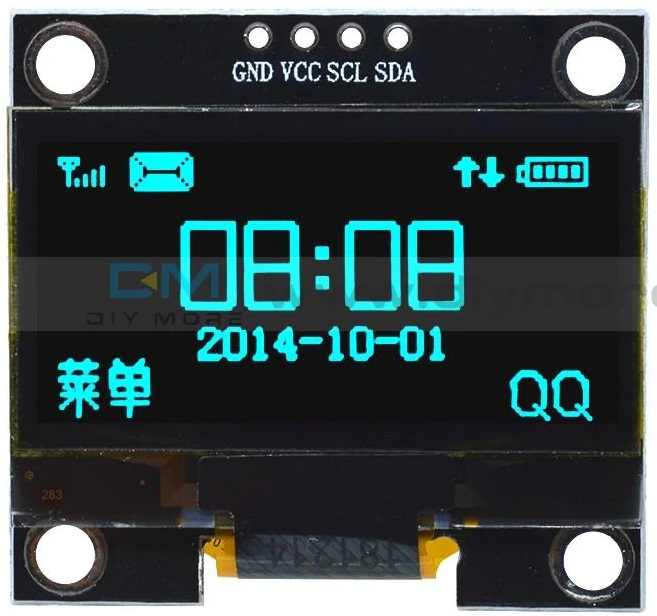

# MagSenseUI

## 🎯 Project Purpose

The **MagSenseUI** project was developed to address a specific diagnostic challenge in electromechanical systems—particularly in machines like **Bill Validators** that rely on magnetic sensors for operation.

### 🧩 Problem Context

These machines often operate in environments where **strong neodymium magnets** are permanently present. While these magnets are essential to the machine’s function, they also create a **constant magnetic field** that can interfere with nearby components.

One such component is the **metallic bearing**. Under normal conditions, the bearing is non-magnetic. However, if it becomes **magnetized due to external contamination** (e.g., exposure to magnetic particles or prolonged proximity to strong fields), it can **distort the local magnetic environment**. This distortion may lead to **false readings or operational errors** in the machine’s magnetic sensors.

### 🧪 Why MagSenseUI?

While a traditional compass can detect strong magnetization, it **fails to detect subtle or low-level magnetization**. This is where **MagSenseUI** excels.

- It uses the **MLX90393** high-resolution 3-axis magnetometer to **detect even slight magnetic anomalies**.
- The system allows the user to **select different gain levels**, enhancing sensitivity to weak fields.
- Through a simple OLED interface and serial output mode, it provides **real-time feedback** on the magnetic field strength in microteslas (µT).
- This enables technicians to **identify which bearing is magnetized**, even if the magnetization is minimal and invisible to conventional tools.


## Hardware Components
- Arduino Nano
- OLED Display 1.3" (SH1106)
- MLX90393 Magnetic Sensor
- Push Buttons (x3)


---

## 🔧 Technical Specifications

### 🧠 Arduino Nano
The **Arduino Nano** is a compact, breadboard-friendly microcontroller board based on the **ATmega328P**. It is ideal for small-scale embedded projects.

- **Microcontroller**: ATmega328P
- **Operating Voltage**: 5V
- **Input Voltage (recommended)**: 7–12V
- **Digital I/O Pins**: 14 (6 PWM outputs)
- **Analog Input Pins**: 8
- **Flash Memory**: 32 KB (2 KB used by bootloader)
- **SRAM**: 2 KB
- **EEPROM**: 1 KB
- **Clock Speed**: 16 MHz
- **Communication**: UART, I2C (A4/A5), SPI
- **USB Interface**: Mini USB (via CH340 or FT232)


---

### 🧲 MLX90393 Magnetic Sensor
The **MLX90393** is a highly sensitive 3-axis magnetometer designed for precision magnetic field sensing.

- **Measurement Axes**: X, Y, Z
- **Output**: Magnetic field in microteslas (µT)
- **Resolution**: Configurable (up to 0.161 µT/LSB)
- **Gain Settings**: 1X to 5X (selectable)
- **Interface**: I2C (also supports SPI)
- **I2C Address**: 0x0C (default)
- **Supply Voltage**: 2.2V – 3.6V
- **Current Consumption**: ~2.5 mA (active), ~1 µA (standby)
- **Features**:
  - Programmable gain, resolution, oversampling, and filtering
  - High sensitivity for detecting small magnetic variations
  - Ideal for contactless position sensing and field mapping


---

### 🖥️ OLED Display 1.3" (SH1106)
This **1.3-inch OLED** display uses the **SH1106** driver and communicates via I2C. It is perfect for compact UIs in embedded systems.

- **Resolution**: 128 × 64 pixels
- **Display Type**: Monochrome OLED
- **Driver IC**: SH1106
- **Interface**: I2C (SDA/SCL)
- **Operating Voltage**: 3.3V – 5V
- **Power Consumption**: Low (no backlight needed)
- **Viewing Angle**: >160°
- **Library Support**: U8g2, Adafruit SH1106, etc.




## Wiring Diagram
Connect components via I2C:
- **OLED**: SDA → A4, SCL → A5  
- **MLX90393**: SDA → A4, SCL → A5  
- **Buttons**:  
  - UP → D2  
  - DOWN → D3  
  - SELECT → D4  


## Usage
1. Upload the `MagSenseUI.ino` sketch to your Arduino Nano.
2. Use the buttons to navigate the OLED menu and select gain settings.
3. Configuration is saved to EEPROM.
4. Optionally activate Serial Mode to stream magnetic field data (X, Y, Z in µT).

```CPP
#include <Wire.h>
#include <U8g2lib.h>
#include "Adafruit_MLX90393.h"
#include <EEPROM.h>

U8G2_SH1106_128X64_NONAME_1_HW_I2C display(U8G2_R0);
Adafruit_MLX90393 magneticSensor;

#define BUTTON_UP     2
#define BUTTON_DOWN   3
#define BUTTON_SELECT 4

const char* gainLabels[] = {
  "1X", "1.33X", "1.67X", "2X", "2.5X", "3X", "4X", "5X", "Serial ON"
};

const mlx90393_gain gainValues[] = {
  MLX90393_GAIN_1X, MLX90393_GAIN_1_33X, MLX90393_GAIN_1_67X,
  MLX90393_GAIN_2X, MLX90393_GAIN_2_5X, MLX90393_GAIN_3X,
  MLX90393_GAIN_4X, MLX90393_GAIN_5X
};

const int TOTAL_OPTIONS = 9;
int currentOption = 0;
bool isConfigured = false;
bool serialModeActive = false;

const unsigned long TIMEOUT_MS = 3000;
unsigned long lastInteractionTime = 0;
bool interactionOccurred = false;

unsigned long lastMeasurementTime = 0;
const unsigned long MEASUREMENT_INTERVAL = 500;

float magX, magY, magZ;
bool readSuccess = false;

const int visibleMenuOptions = 5;
int menuScrollOffset = 0;

unsigned long lastButtonUpTime = 0;
unsigned long lastButtonDownTime = 0;
unsigned long lastButtonSelectTime = 0;
const unsigned long debounceDelay = 200;

void setup() {
  Serial.begin(115200);

  display.begin();
  display.enableUTF8Print();
  display.setFont(u8g2_font_ncenB08_tr);

  pinMode(BUTTON_UP, INPUT_PULLUP);
  pinMode(BUTTON_DOWN, INPUT_PULLUP);
  pinMode(BUTTON_SELECT, INPUT_PULLUP);

  int savedOption = EEPROM.read(0);
  currentOption = (savedOption >= 0 && savedOption < 8) ? savedOption : 0;

  if (!magneticSensor.begin_I2C()) {
    showErrorMessage("Sensor not found");
    while (1);
  }

  magneticSensor.setGain(gainValues[currentOption]);
  magneticSensor.setResolution(MLX90393_X, MLX90393_RES_17);
  magneticSensor.setResolution(MLX90393_Y, MLX90393_RES_17);
  magneticSensor.setResolution(MLX90393_Z, MLX90393_RES_17);
  magneticSensor.setOversampling(MLX90393_OSR_3);
  magneticSensor.setFilter(MLX90393_FILTER_5);

  showConfigurationMenu();
}

void loop() {
  if (!isConfigured) {
    handleMenu();
  } else {
    handleSensorReadings();
  }
}

void adjustScroll() {
  if (currentOption < menuScrollOffset) {
    menuScrollOffset = currentOption;
  } else if (currentOption >= menuScrollOffset + visibleMenuOptions) {
    menuScrollOffset = currentOption - visibleMenuOptions + 1;
  }
}

void handleMenu() {
  bool upPressed = (digitalRead(BUTTON_UP) == LOW);
  bool downPressed = (digitalRead(BUTTON_DOWN) == LOW);
  bool selectPressed = (digitalRead(BUTTON_SELECT) == LOW);
  unsigned long now = millis();
  bool refreshDisplay = false;

  if (upPressed && now - lastButtonUpTime > debounceDelay) {
    currentOption = (currentOption - 1 + TOTAL_OPTIONS) % TOTAL_OPTIONS;
    adjustScroll();
    lastButtonUpTime = now;
    refreshDisplay = true;
    interactionOccurred = true;
    lastInteractionTime = now;
  }

  if (downPressed && now - lastButtonDownTime > debounceDelay) {
    currentOption = (currentOption + 1) % TOTAL_OPTIONS;
    adjustScroll();
    lastButtonDownTime = now;
    refreshDisplay = true;
    interactionOccurred = true;
    lastInteractionTime = now;
  }

  if (selectPressed && now - lastButtonSelectTime > debounceDelay) {
    if (currentOption == 8) {
      serialModeActive = true;
      isConfigured = true;
      Serial.println("\n\n--- SERIAL MODE ACTIVATED ---");
      Serial.println("Format: X[uT]  Y[uT]  Z[uT]");
      Serial.println("----------------------------");
    } else {
      isConfigured = true;
      EEPROM.write(0, currentOption);
      magneticSensor.setGain(gainValues[currentOption]);
    }
    showConfigurationSummary();
    lastButtonSelectTime = now;
    return;
  }

  if (!interactionOccurred && now - lastInteractionTime >= TIMEOUT_MS) {
    if (currentOption >= 8) currentOption = 0;
    isConfigured = true;
    EEPROM.write(0, currentOption);
    showConfigurationSummary();
    return;
  }

  if (refreshDisplay) {
    showConfigurationMenu();
  }
}

void showConfigurationMenu() {
  display.firstPage();
  do {
    display.drawStr(0, 8, "Select option:");
    for (int i = 0; i < visibleMenuOptions; i++) {
      int index = menuScrollOffset + i;
      if (index >= TOTAL_OPTIONS) break;
      int y = 20 + i * 10;
      if (index == currentOption) display.drawStr(0, y, ">");
      display.setCursor(10, y);
      display.print(gainLabels[index]);
    }
  } while (display.nextPage());
}

void showConfigurationSummary() {
  display.firstPage();
  do {
    display.setCursor(0, 15);
    display.print("Configuration:");
    display.setCursor(0, 30);

    if (currentOption == 8) {
      display.print("Serial: ON");
      display.setCursor(0, 45);
      display.print("Display: OFF");
    } else {
      display.print("Gain: ");
      display.setCursor(60, 30);
      display.print(gainLabels[currentOption]);
    }
  } while (display.nextPage());

  delay(2000);
}

void handleSensorReadings() {
  unsigned long now = millis();

  if (now - lastMeasurementTime >= MEASUREMENT_INTERVAL) {
    lastMeasurementTime = now;
    readSuccess = magneticSensor.readData(&magX, &magY, &magZ);

    if (serialModeActive && readSuccess) {
      Serial.print("X: "); Serial.print(magX, 2); Serial.print(" uT\t");
      Serial.print("Y: "); Serial.print(magY, 2); Serial.print(" uT\t");
      Serial.print("Z: "); Serial.print(magZ, 2); Serial.println(" uT");
    }

    if (!serialModeActive || currentOption != 8) {
      display.firstPage();
      do {
        if (readSuccess) {
          display.setCursor(0, 15);
          display.print("X: "); display.print(magX, 1); display.print(" uT");
          display.setCursor(0, 30);
          display.print("Y: "); display.print(magY, 1); display.print(" uT");
          display.setCursor(0, 45);
          display.print("Z: "); display.print(magZ, 1); display.print(" uT");
          display.setCursor(0, 60);
          display.print("Gain: ");
          display.print(gainLabels[currentOption]);
        } else {
          display.setCursor(0, 30);
          display.print("Read error");
        }
      } while (display.nextPage());
    }
  }
}

void showErrorMessage(const char* message) {
  display.firstPage();
  do {
    display.drawStr(0, 30, message);
  } while (display.nextPage());
}
```
