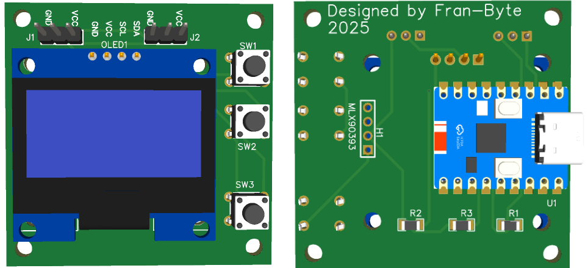
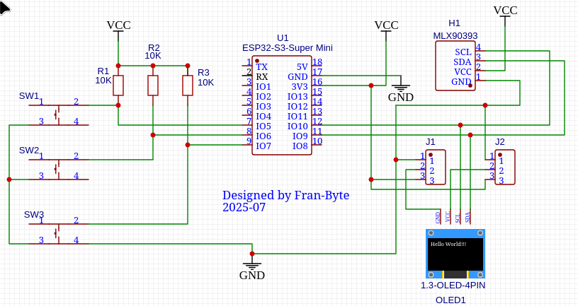

# MagSenseUI
# Diagnostic Interface for Magnetic Sensor Calibration in Electromechanical Systems

## 🎯 Project Purpose

The **MagSenseUI** project was developed to address a specific diagnostic challenge in electromechanical systems—particularly in machines like **Bill Validators** that rely on magnetic sensors for operation.

The program includes an intuitive **menu** system that allows users to configure the **sensor gain** and choose the data output mode. Users can select whether the magnetic field readings are displayed directly on the OLED screen or streamed via the Arduino's **serial port** to a connected PC. This flexibility makes it easy to adapt the system for both standalone field diagnostics and detailed data logging or analysis on a computer.

## 🧰 **Hardware Components**

| Component         | Description                                      |
|------------------|--------------------------------------------------|
| [Arduino ESP32](doc/esp32.webp)      | Microcontroller ESP32-S3 Super Mini                    |
| [OLED Display 1.3"](doc/SH1106.pdf) | SH1106-based I2C monochrome display             |
| [MLX90393 Sensor](doc/MLX90393.PDF)   | 3-axis magnetometer with adjustable gain        |
| Push Buttons (x3) | For menu navigation and selection               |






- Although the sensor appears to be mounted on the PCB, it is actually connected to it by wires in order to improve its performance and maneuverability.

- Another important point to consider is the use of jumpers J1 and J2, which are used to configure the different versions of the 1.3" OLED displays, as the power supply pins are reversed (positive and negative) in some versions.

## 🧭 **Menu System**

```plaintext
[ Configuration Menu ]
-----------------------
1. Gain: 1X
2. Gain: 1.33X
3. Gain: 1.67X
4. Gain: 2X
5. Gain: 2.5X
6. Gain: 3X
7. Gain: 4X
8. Gain: 5X
9. Enable Serial Output
```


### 🧩 Problem Context

These machines often operate in environments where **strong neodymium magnets** are permanently present. While these magnets are essential to the machine’s function, they also create a **constant magnetic field** that can interfere with nearby components.

One such component is the **metallic bearing**. Under normal conditions, the bearing is non-magnetic. However, if it becomes **magnetized due to external contamination** (e.g., exposure to magnetic particles or prolonged proximity to strong fields), it can **distort the local magnetic environment**. This distortion may lead to **false readings or operational errors** in the machine’s magnetic sensors.

### 🧪 Why MagSenseUI?

While a traditional compass can detect strong magnetization, it **fails to detect subtle or low-level magnetization**. This is where **MagSenseUI** excels.

- It uses the **MLX90393** high-resolution 3-axis magnetometer to **detect even slight magnetic anomalies**.
- The system allows the user to **select different gain levels**, enhancing sensitivity to weak fields.
- Through a simple OLED interface and serial output mode, it provides **real-time feedback** on the magnetic field strength in microteslas (µT).
- This enables technicians to **identify which bearing is magnetized**, even if the magnetization is minimal and invisible to conventional tools.

---

## 🔧 Technical Specifications

### 🧠 ESP32 Mini  
The **ESP32 Mini** is a compact, ultra-low-power microcontroller module based on the **ESP32** chip by Espressif. It’s ideal for embedded applications requiring Wi-Fi, Bluetooth, and high processing power in a small footprint.

- **Microcontroller**: Dual-core Xtensa LX7 CPU (up to 240 MHz)  
- **Dimensions**: 22.52 × 18 mm  
- **Flash Memory**: 4 MB  
- **SRAM**: 512 KB  
- **ROM**: 384 KB  
- **Digital I/O Pins**: 11  
- **External Interrupt Pins**: 22  
- **Analog Input Pins**: 6  
- **PWM Output Pins**: 11  
- **Operating Voltage (logic and power)**: 3.3V  
- **Input Voltage (via regulator)**: 5V (e.g., via USB-UART adapter)  
- **Deep Sleep Current**: ~43 µA  
- **Connectivity**: Wi-Fi 802.11 b/g/n, Bluetooth v4.2 BR/EDR + BLE  
- **Security Features**: AES-128/256, RSA, HMAC, digital signatures, secure boot  
- **Onboard LED**: WS2812 RGB (programmable multicolor status LED)  
- **Interfaces**: UART, I2C, SPI, PWM, ADC, DAC  
- **USB Interface**: Not built-in (requires external USB-to-Serial adapter for programming)


---

### 🧲 MLX90393 Magnetic Sensor
The **MLX90393** is a highly sensitive 3-axis magnetometer designed for precision magnetic field sensing.


The MLX90393 features a wide dynamic range and programmable gain, allowing it to detect very small magnetic fields without being affected by saturation, even in environments with strong magnetic sources such as neodymium magnets.

- **Measurement Axes**: X, Y, Z
- **Output**: Magnetic field in microteslas (µT)
- **Resolution**: Configurable (up to 0.161 µT/LSB)
- **Gain Settings**: 1X to 5X (selectable)
- **Interface**: I2C (also supports SPI)
- **I2C Address**: 0x0C (default)
- **Supply Voltage**: 2.2V – 3.6V
- **Current Consumption**: ~2.5 mA (active), ~1 µA (standby)
- **Features**:
  - Programmable gain, resolution, oversampling, and filtering
  - High sensitivity for detecting small magnetic variations
  - Ideal for contactless position sensing and field mapping

### ⚠️ Limitations

It cannot accurately detect static magnetic fields below 0.1 µT.


### I2C (Inter-Integrated Circuit)

I²C is a two-wire communication protocol used to connect microcontrollers with peripheral devices like sensors, displays, and EEPROMs.


I²C uses 2 lines: SDA (data) and SCL (clock)

It works between a master (e.g. Arduino) and one or more slaves (e.g. sensor)

The master:

1. Starts the communication

2. Sends the slave’s address

3. Sends or requests data

4. Ends the communication

Each bit is sent with a clock pulse

Common because it allows multiple devices with just two wires


### I²C Clock (SCL)

In I²C, the clock (SCL) is **not a continuous or fixed-frequency signal**. 

It's controlled by the master, may pause, and its timing can vary.  
SCL acts as a **synchronization signal**, not a typical free-running clock.

---

### 🖥️ OLED Display 1.3" (SH1106)
This **1.3-inch OLED** display uses the **SH1106** driver and communicates via I2C. It is perfect for compact UIs in embedded systems.

- **Resolution**: 128 × 64 pixels
- **Display Type**: Monochrome OLED
- **Driver IC**: SH1106
- **Interface**: I2C (SDA/SCL)
- **Operating Voltage**: 3.3V – 5V
- **Power Consumption**: Low (no backlight needed)
- **Viewing Angle**: >160°
- **Library Support**: U8g2, Adafruit SH1106, etc.


## Wiring Diagram


## 🔌 Connect Components via I²C (ESP32 Mini)

- **OLED Display (SH1106)**  
  - **SDA → GPIO9**  PIN 11
  - **SCL → GPIO10**  PIN 12

- **MLX90393 Sensor**  
  - **SDA → GPIO9**  PIN 11
  - **SCL → GPI10**  PIN 12

- **Push Buttons**  
  - **UP → GPIO5**  PIN 7
  - **DOWN → GPIO6**  PIN 8
  - **SELECT → GPIO7** PIN 9


## 🚀 **How to Use**

1. Upload the `MagSenseUI.ino` sketch to your Arduino.
2. Use the buttons to navigate the OLED menu and select gain levels.
3. Settings are saved to EEPROM.
4. Optionally enable Serial Mode to stream real-time magnetic field data (X, Y, Z in µT) to a PC.

📂 **Code**: [View Source Code](code.ino)

## 📄 License

This project is licensed under the MIT License.

## 🙌 Credits

Developed by **Fran-Byte**. Based on Melexis magnetic sensors and Arduino libraries.

